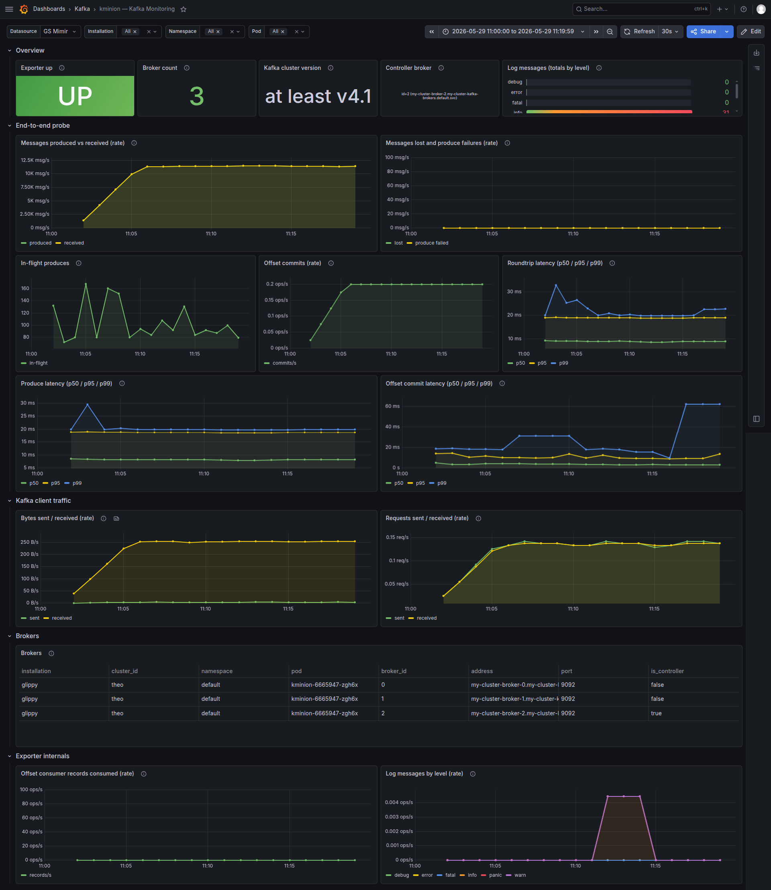
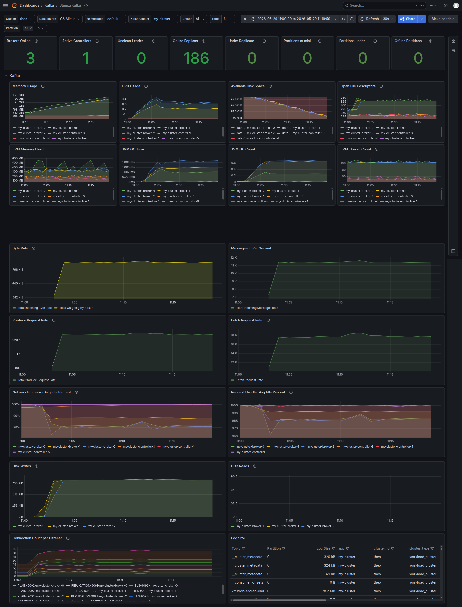
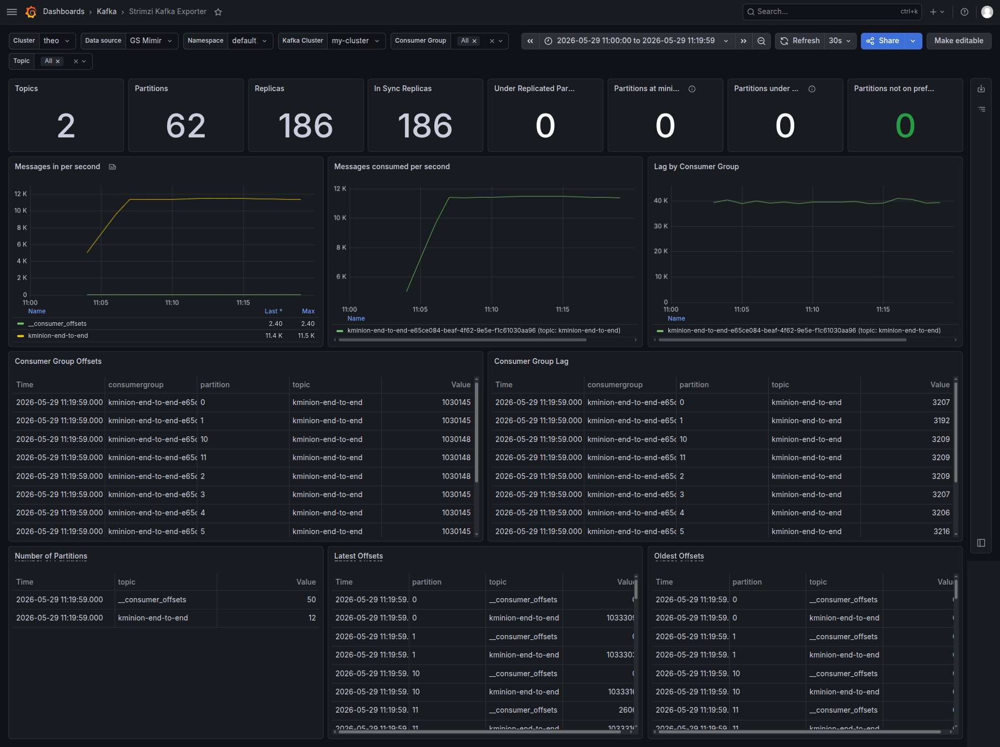
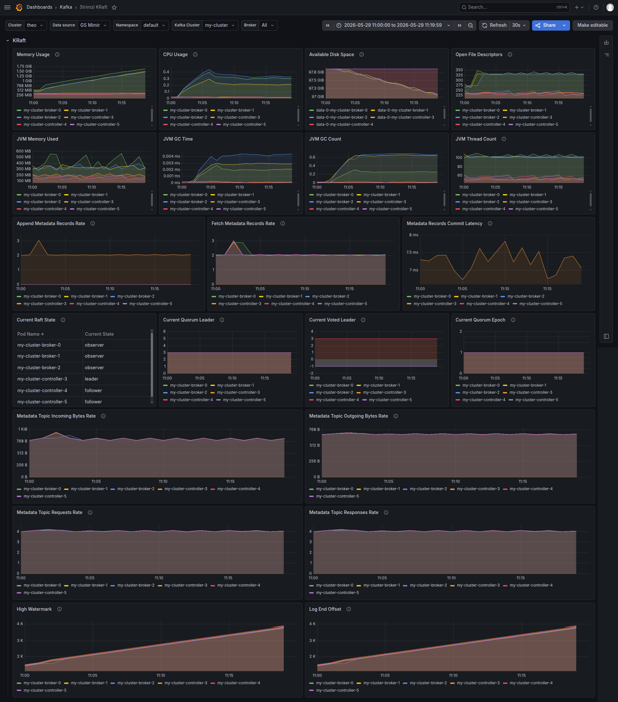

# Benchmark

Load test against a Strimzi-managed Kafka cluster on Giant Swarm. The idea: spin up a
realistic cluster, push a steady stream of traffic through it, and see what the dashboards
tell us — where the cluster is comfortable, and where (if anywhere) it starts to struggle.

## Setup

### Infrastructure

1. Create a cluster with 3 control-plane and 2 worker nodes.

Node spec:

- Kubernetes v1.34.3
- Giantswarm release v34.1.0
- CPU: 4 x AMD EPYC 7763 64-Core Processor
- RAM: 16GB

See our [cluster creation docs](https://docs.giantswarm.io/getting-started/provision-your-first-workload-cluster/) for details.

2. Install Strimzi

```
helm install strimzi-kafka-operator giantswarm/strimzi-kafka-operator \
    --version 0.1.1 \
    --set dashboards.enabled=false
```

3. Create a Kafka cluster

```
kubectl apply -f https://raw.githubusercontent.com/strimzi/strimzi-kafka-operator/refs/tags/1.0.0/examples/metrics/strimzi-metrics-reporter/kafka-metrics.yaml
```

This deploys a **KRaft** cluster (Kafka ≥ v4.1) with a split topology:

- **3 brokers** — `my-cluster-broker-0`, `-1`, `-2` (data plane)
- **3 dedicated controllers** — `my-cluster-controller-3`, `-4`, `-5` (KRaft quorum / metadata plane)

### Load

4. Run load testing with KMinion

Using a 1ms probe interval and 4 partitions per broker, targeting roughly **10,000 messages/sec**.

```
helm install kminion redpanda/kminion --version 0.15.1 -f values-kminion.yaml
```

KMinion runs its **end-to-end probe**: it continuously produces small messages to a dedicated
`kminion-end-to-end` topic, consumes them back, and measures the full round-trip. So it's
both the load generator and the latency source of truth. See [KMinion end to end monitoring](https://github.com/redpanda-data/kminion/blob/master/docs/end-to-end.md) for more information.

### Test window

The run lasted ≈ 15 minutes (≈ 11:02 → 11:17). Traffic ramps from zero, reaches a steady
plateau by 11:05, and holds there for 12 minutes. All numbers below are read at steady state unless noted.

## Results

### 1. Load generator — kminion end-to-end probe


This dashboard is provided here [kminion-dashboard.json](kminion-dashboard.json).

This is the most important view: it tells us what the client actually experienced.

- **Throughput**: produced and received message rates climb together to a plateau of
  **≈ 10,000 msg/s** and stay locked on top of each other for the whole run. The two lines
  overlapping is the key result — *everything produced was received*.
- **Correctness**: *Messages lost and produce failures* sits flat at **0** for the entire
  test. No data loss, no produce errors.
- **Round-trip latency** (produce → replicate → consume → commit):
  - p50 ≈ **8 ms**
  - p95 ≈ **19 ms**
  - p99 ≈ **20 ms**, with a single early spike to ≈ 33 ms during ramp-up, then flat.
- **Produce latency** mirrors the round-trip almost exactly (p50 ≈ 8 ms, p95/p99 ≈ 19–20 ms),
  which means the round-trip cost is dominated by the produce + replication path, not by
  the consume side.
- **Offset-commit latency** is low p50 ≈ 2 ms, p95 ≈ 10 ms, p99 ≈ 18 ms.

Takeaway: from the client's perspective the cluster delivers single-digit-millisecond
median latency with a tight, stable tail, and loses nothing.

### 2. Broker (data plane) — Strimzi Kafka dashboard



Cluster health counters stayed clean the entire run:

| Metric | Value |
| --- | --- |
| Brokers online | 3 |
| Active controllers | 1 |
| Online replicas | 186 |
| Under-replicated partitions | 0 |
| Partitions under min ISR | 0 |
| Offline partitions | 0 |
| Unclean leader elections | 0 |

Throughput as seen by the brokers:

- **Incoming message rate**: plateau just under **11K msg/s** — consistent with the client view.
- **Incoming byte rate**: **≈ 800 KiB/s**. **Outgoing byte rate** tracks it at ≈ 800 KiB/s,
  which is replication doing its job (the test topic is replicated across all 3 brokers).
- **Produce request rate**: ≈ **1.25K req/s**.
- **Fetch request rate**: ≈ **17.5K req/s** — much higher than produce, driven by
  follower-replication fetches plus the probe's tight consumer polling.

Saturation — this is where the story gets interesting:

- **CPU usage**: ≈ **0.3 cores** per broker out of 4 available (≈ 7–8%). It peaked at ≈ 0.4
  cores during startup and then settled.
- **Network processor idle**: stays around **98%** (brief dip to ≈ 97.5% on one broker at startup).
- **Request handler idle**: stays around **98–99%** (one momentary dip to ≈ 96% at startup).
- **Memory**: grows steadily from ≈ 512 MiB to ≈ **1.6 GiB**, nowhere near the 16 GB
  available. This is **page cache**, not a leak — Kafka serves its log reads and writes
  through the filesystem cache by design, so cached pages accumulate as data flows.[^pagecache]
  The JVM heap itself stays bounded (sawtooths ≈ 100–600 MB), and the controllers, which do
  little log I/O, stay flat at ≈ 256 MiB.

[^pagecache]: Kafka Design — *Persistence*: "Kafka relies heavily on the filesystem for storing and caching messages… All disk reads and writes will go through this unified cache." <https://kafka.apache.org/documentation/#design>
- **Disk**: available space drops from 97.8 GiB to ≈ 97.0 GiB — roughly **0.8 GiB written in
  15 min**, expected for a small-message workload.
- **Open file descriptors**: flat at ≈ 330 per broker.

Takeaway: the brokers are essentially idle. With request handlers ≈ 98% idle and CPU below
10%, the cluster is nowhere near its limits at this load.

### 3. Topic / consumer view — Strimzi Kafka Exporter dashboard



- **Topics**: 2 (`kminion-end-to-end` + `__consumer_offsets`).
- **Partitions**: 62 — 12 for the test topic (4 per broker × 3) plus 50 for `__consumer_offsets`.
- **Replicas / in-sync replicas**: **186 / 186** — every replica in sync, the whole time.
- **Messages in/consumed per second**: both ≈ **11.4K/s** on `kminion-end-to-end`; the
  consume rate matches the produce rate, so the consumer keeps pace.
- **Lag by consumer group**: shows a steady **≈ 40K messages**. This looks alarming but is
  an **artifact of the offset-commit interval**, not a real backlog: offsets are committed
  at ≈ 0.2 ops/s (every ≈ 5 s), so at 11.4K msg/s the *committed* offset trails the *latest*
  offset by a few seconds' worth of messages. The end-to-end round-trip staying at ≈ 8 ms
  confirms messages are actually consumed near-instantly — nothing is piling up.

### 4. Control plane — Strimzi KRaft dashboard



The KRaft metadata quorum was undisturbed by the data-plane load:

- **Quorum**: leader = `controller-3`; `controller-4` and `-5` are followers; the 3 brokers
  are observers — exactly as expected.
- **Quorum epoch**: constant at **1** for the whole run → **no leader elections, no failovers**.
- **Metadata commit latency**: ≈ **7 ms**.
- **Metadata record rate**: ≈ **2 records/s** and metadata-topic traffic **< 1 KiB/s**.

Takeaway: a steady data-plane workload generates almost no metadata churn. The control
plane sat idle, which is the desired separation-of-concerns behavior for a dedicated-controller
KRaft topology.

## Conclusion

At ≈ 10,000 messages/sec the cluster handled the load without issue and had plenty of room
to spare:

- **Reliability**: zero lost messages, zero produce failures, zero under-replicated or offline
  partitions, and a stable KRaft quorum with no elections. All 186 replicas stayed in sync
  end to end.
- **Latency**: ≈ 8 ms median and ≈ 20 ms p99 round-trip, stable throughout.
- **Headroom**: CPU stayed below 10% of a single core per broker, request handlers and network
  processors were ≈ 98% idle, memory and disk grew slowly and predictably. **The bottleneck
  was never reached.**

The 10,000 msg/s figure is a comfortable operating point, not a ceiling. This workload is
small-message and low-byte (≈ 800 KiB/s), so it exercises the request/replication path far
more than CPU, network bandwidth, or disk. There's plenty of headroom left.

### Suggested follow-ups

To actually find the limits:

1. **Larger payloads** — to stress byte throughput, disk I/O and page cache rather than just request rates.
2. **Higher message rates / more producers** — to drive request handlers toward saturation and see where latency tails start to grow.
3. **Failure injection under load** — kill a broker mid-run to validate ISR shrink/recovery, leader re-election, and the latency impact during failover.
